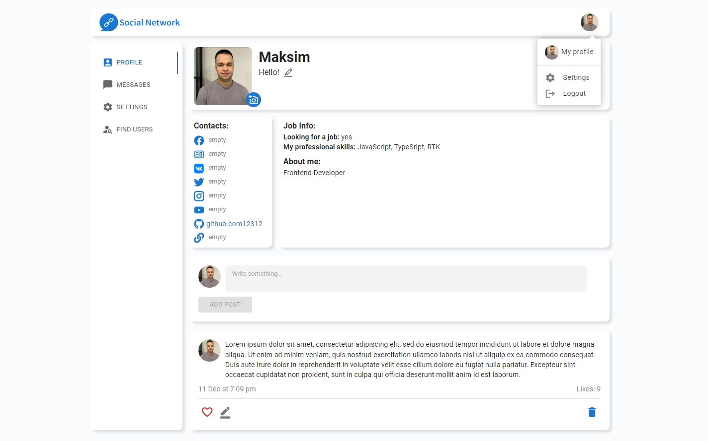

# React Social Network

  

    
    
    

### Links:

> [Social Network](https://skate090961.github.io/samurai-way/) - web application

### Description:

A social network that implements subscription to users, change of status, photo of the user and his personal data, change of theme. Locally it is possible to create wall posts and send messages in dialogues. In the future, sending messages to specific users and general chat will be implemented.

In the application, you can log in using a test account or follow the link to register your own. All login information is provided on the login page.

## Tech Stack:
- React
- TypeScript
- Redux, Redux-Thunk
- Axios
- CSS modules
- Jest
- React-hook-form
- Material UI
